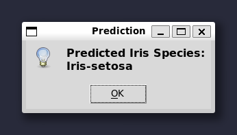

# Iris Flowers Classification with k-Nearest Neighbors

This repository contains a Python package that implements the k-Nearest Neighbors (k-NN) algorithm for classifying Iris flowers into three species: setosa, versicolor, and virginica. The package uses the Iris dataset, which consists of 150 samples with 4 features each: sepal length, sepal width, petal length, and petal width.

The k-NN model is trained on the Iris dataset using 5-fold cross-validation and 10 neighbors, which can be changed in the script. After training, the model allows you to input your own values for sepal length, sepal width, petal length, and petal width. The model will then predict the flower category (setosa, versicolor, or virginica) based on the input provided by the user.

## Installation

You can install the package directly from [PyPI](https://pypi.org/project/IrisKNNClassifier/1.0.0/) using `pip`:

```sh
pip install IrisKNNClassifier
```

Alternatively, you can install it from the source distribution:

1. Download the package from the repository or from PyPI.
2. Extract the contents of the `.tar.gz` file.
3. Navigate to the directory containing `setup.py`.
4. Run the following command:

```sh
pip install .
```

## Running the Script

After installing the package, you can run the classifier directly:

```sh
iris-classifier
```

## Class Diagram

Below is an overview of the classes and their interactions in the script:


* **KNearestNeighbors**: This class is responsible for the k-NN algorithm implementation, including training the model and making predictions.

* **DataLoader**: This class loads the Iris dataset from a file.

* **Preprocessor**: This class normalizes the dataset to ensure that all features are on the same scale, which is important for distance-based algorithms like k-NN, converts string values to float, and converts class labels to integers.

* **CrossValidator**: This class evaluates the k-NN model using cross-validation. It splits the dataset into a specified number of folds and computes the accuracy for each fold. It then returns a list of accuracy scores.

The `DataLoader` and `Preprocessor` classes provide the data and preprocessing needed for the `KNearestNeighbors` class. The `CrossValidator` class evaluates the k-NN model using the provided data.

To customize the script, you can modify the `n_folds` and `num_neighbors` variables, which represent the number of cross-validation folds and the number of neighbors in the k-NN algorithm, respectively.

To get started, follow the instructions in the "Getting Started" section of the README. Make sure to install the required libraries using the provided `requirements.txt` file. After running the script, you can input your own values for sepal length, sepal width, petal length, and petal width to see the model's predictions.

## Getting Started

These instructions will guide you on how to run the script on your local machine.

### Running the Script

1. Clone this repository to your local machine:

```sh
git clone https://github.com/sminerport/iris-knn-classifier.git
```

2. Navigate to the repository's directory:

```sh
cd iris-knn-classifier
```

3. Run the script:

```sh
python src/app/iris_classifier_app.py
```

The script will train the k-NN model on the Iris dataset, using 5-fold cross-validation and 10 neighbors (you can change these values). It will print the accuracy for each fold and the mean accuracy.


After training the model, you can input your own values for sepal length, sepal width, petal length, and petal width. The model will predict the flower category (setosa, versicolor, or virginica) based on the input provided by the user.




## Customizing the Script

You can customize the number of cross-validation folds and the number of neighbors in the k-NN algorithm by modifying the `n_folds` and `num_neighbors` variables in the script.

## License

This project is licensed under the MIT License - see the [LICENSE](LICENSE) file for details.

## Acknowledgments

* The Iris dataset was introduced by the British statistician and biologist Ronald Fisher in his 1936 paper "The use of multiple measurements in taxonomic problems."
* The k-Nearest Neighbors algorithm is a simple yet powerful classification technique, particularly suitable for problems with small datasets and relatively low-dimensional feature spaces.
